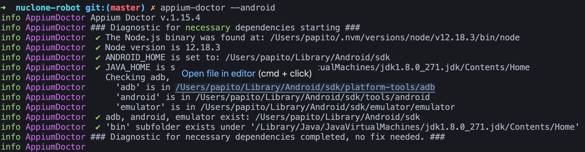

<h1 align="center">
    
</h1>

## 👨‍💻 Tecnologias

Você vai precisar das seguintes ferramentas e tecnologias:

- [Python](https://www.python.org/downloads/)
- [Node.js](https://nodejs.org/en/)
- [Java JDK8](http://www.oracle.com/technetwork/pt/java/javase/downloads/jdk8-downloads-2133151.html)
- [Android Studio](https://developer.android.com/studio/index.html?hl=pt-br)
- [Appium](http://appium.io/downloads.html)
- [Robot Framework](https://robotframework.org/)

## 💻 Ferramentas

Você pode baixar e instalar o JDK 8 através [desse link](http://www.oracle.com/technetwork/pt/java/javase/downloads/jdk8-downloads-2133151.html).

Android Studio é a IDE oficial para desenvolvimento e testes de aplicativos para Android
Você pode baixar a ultima através [desse link](https://developer.android.com/studio/index.html?hl=pt-br)

## 🔖 Variáveis de ambiente

### No Linux ou Mac

Configure as seguintes váriávies de ambiente no **bash_profile** ou **zshrc** do seu Linux ou Mac:

```bash
export JAVA_HOME=$(/usr/libexec/java_home -v 1.8)
export ANDROID_HOME=~/Library/Android/sdk

PATH=$PATH:$ANDROID_HOME/platform-tools
PATH=$PATH:$ANDROID_HOME/tools
PATH=$PATH:$ANDROID_HOME/tools/bin
PATH=$PATH:$ANDROID_HOME/tools/lib
PATH=$PATH:$JAVA_HOME/bin
```

Para ZSH, execute o comando:

```bash
source ~/.zshrc
```

Para Bash, execute o comando:

```bash
source ~/.bashrc
```

### No Windows

[](https://youtu.be/ZsOq4xoTid0 "Variáveis de ambiente no Windows")


## 📱Appium 

- Com o Node.js instalado, execute:

  | Se estiver no Windows, execute no Prompt como Administrador

```bash
npm install -g appium
npm install -g appium-doctor
```

- Em seguida, execute:

```bash
appium-doctor --android
```

- Deve aprensentar um resultado similar ao da imagem abaixo:

<h1 align="left">
    
</h1>

## 📱Appium Desktop

Instale o Appium Desktop Latest release (não faça download do Pre-release)


## 🤔 Executar

- Abra o Appium Desktop e clique em Start Server;
- Acesse a pasta do projeto;
- Instale o Robot e a Lib do Appium conforme descrito na [doc](https://robotframework.org/);
- Execute o comando: `robot -d ./logs tests'`;
- Enjoy.

---

<h1 align="left">
    
</h1>

## 👨‍💻 Meu curso de Robot com Appium

- [No Dojo da QA Ninja](https://qaninja.academy/curso/introducao-ao-appium-com-robot-framework/)

Feito com ♥ in OZ :wave: [Saiba mais aqui!](https://qaninja.academy)
